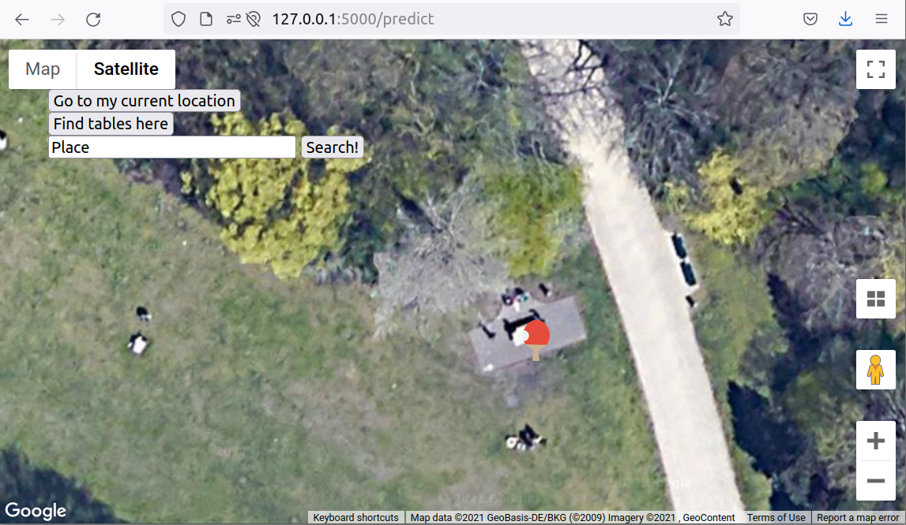

# Ana's Ping Pong

Data science retreat batch 28 (https://datascienceretreat.com/) portfolio project.

We use satellite images and computer vision to spot and tag public ping pong 
tables on a map.

  

## Object detection model
We re-trained detectron2 model ‘faster_rcnn_R_101_FPN_3x’ (pretrained on COCO dataset) 
using approx. 1200 bounding-box labeled map tiles downloaded from bing maps.
Model loading is done in `webserver/anaspingpong/predictor.py`.

## Webserver

For the prediction, 25 tiles in the current center of the map
are temporarily downloaded and bounding boxes of ping pong tables
are predicted. The position of the bounding box center is then 
saved in a sqlite database and displayed on the map using a ping 
pong racket icon.

### Life webserver
The life webserver is not yet public, but we'll make the URL available here soon

### Install webserver locally

- get your own key for Google maps API
- create file `webserver/instance/config.py` with `GOOGLE_MAPS_KEY = "your_key""`
- create new environment: `python3 -m venv venv`
- activate: `. venv/bin/activate`
- install requirements: `pip install -r requirements`
- `pip3 install torch==1.10.0+cpu torchvision==0.11.1+cpu  -f https://download.pytorch.org/whl/cpu/torch_stable.html`
- `python -m pip install 'git+https://github.com/facebookresearch/detectron2.git')`
- `cd webserver`
- `export FLASK_APP=anaspingpong`
- `export FLASK_ENV=development`
- `flask init-db`
- `flask run`
- application is now running on http://127.0.0.1:5000
